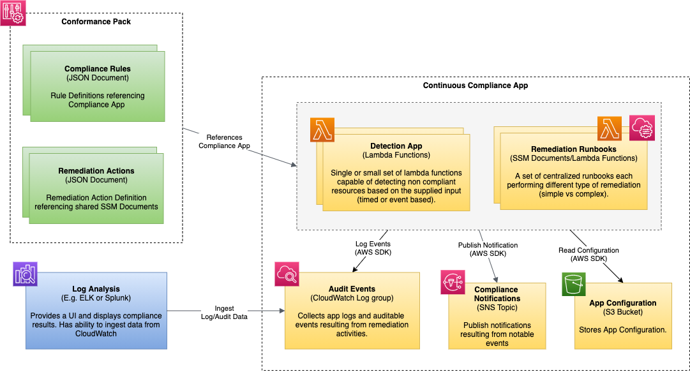

# AWS Continuous Compliance Prototype
This project presents a reference architecture for a continuous compliance system hosted in AWS that leverages the framework offered by the Config and System Manager services. It was created to advance certain ideas within my team and bootstrap development.

This system is loosely based on the artifacts presented in this article:

https://aws.amazon.com/blogs/mt/manage-custom-aws-config-rules-with-remediations-using-conformance-packs/

Although this system can be deployed to a single account, it is intended to run in a multi-account environment where all compliance code is centralized in the **master** account, while the conformance pack rules and required IAM assume roles are deployed to the **member** accounts that are part of an AWS Organization Unit.


## Overview
The system presented here is made of the following components:

1. A Python based compliance application capable of detecting non-compliant resources and applying a remedy to them. This implementation is capable of detecting and remediating S3 buckets whose versioning is disabled.

2. A pair of lambda functions hosting the compliance application. The first will generically detect non-compliant resources given a "command" name, and the second will remediate those resources given similar inputs.

4. An SSM document representing a simple remediation runbook backed by the second lambda function mentioned above.

3. A Conformance Pack that includes a sample rule backed by the first of the two lambda functions mentioned above, and a remediation configuration referencing the SSM document. The config rule is configured to have two triggers: one reacting to S3 Bucket configuration changes, and the other is periodic (every hour).

4. A CloudFormation template containing the necessary resources in the master account and another containing the IAM resources for the member accounts.

# Design



The compliance application is a serverless application implemented in Python and deployed to lambda functions. These function are then used to back the Config rules and SSM documents necessary detect and remediate non-compliant resources. 

The main takeaway is that both lambda functions are intended to be generic and are can be used to implement any number of Config rules and remediations. As the system evolves, if a remediation runbook requires a more complex set of actions, those will be generalized into a pattern and included here. So in its final state this app may grow from two Lambda functions to a small set  with most of them dedicated to remediation activities.


## Features and capabilities

1. Ability to generically implement a Config rule, given a name, referred to here a **Compliance Command**. This prototype implements a single command called **S3_ENABLE_VERSIONING** that identifies S3 Buckets whose versioning is not enabled.

2. Ability to generically remediate an AWS resources using a simple SSM Document that is supplied a resource ID and a compliance command (**S3_ENABLE_VERSIONING**).

3. Ability to publish audit/remediation events to a CloudWatch log group. These events may be ingested by an ELK or Splunk system and provide a basic UI capability (future enhancement).

4. Ability to publish the same events to an SNS Topic (future enhancement).

## Code Organization


At its core this application is made up of **Compliance Modules** implemented as Python classes. Each module contains logic to both detect non-compliant resources and remediate them in some capacity. 

When a rule is evaluated, the payload supplied to the Config Rule Lambda Function will contain a parameter called **ComplianceCommand** which is used to load the appropriate compliance module (using a simple factory class) and will then identify the non-compliant resources. These resources and their compliance status are then reported back to the Config service.

Since this is a multi-account application, and the Lambda Function is centralized in the master account, each triggering event may originate from any one of the member accounts where the rule-pack is deployed. This is an important detail because it requires the function to perform an assume-role operation to the member account based on the AWS account ID contained in the payload, while the role name is defined in the code and must match the role name defined in the member account template.

When a resource is being remediated, the Lambda Function backing the SSM document works in a very similar way. The **ComplianceCommand** and target AWS account ID are extracted from the payload, and an assume-role operation takes place before the appropriate compliance module is loaded and remediation takes place.

# Installing the application

This section describes the steps required to install and configure the application. Please note that if you are deploying this to a single account, then some of the steps can be skipped.

Generally speaking you will perform these steps:
1. Deploy the Compliance Application to the Master Account
2. Deploy the Compliance Application Code
3. Deploy to the Assumed Roles to the Member Accounts (**Multi-account setup**)
4. Allow SSM in Member Accounts to invoke remediation functions (**Multi-account setup**)
5. Share the SSM document with the member accounts (**Multi-account setup**)
6. Deploy the conformance pack
7. Profit


## Deploy the Compliance Application to the Master Account


The cloudformation template `cf-automation\master-account-stack.yaml`, included here, contains the application artfacts described in the Design section of this document, including the lambda functions and the code deployed to them. This stack does not require any parameters and you may deploy using the AWS console, CLI or using your own automation.

## Deploy the Compliance Application code

You can deploy the application code by running the **deploy-app.py** script. The script is supplied the name of the CloudFormation stack deployed to the master account, which is used to identify the target Lambda Functions.

```sh
>>python deploy-app.py -h
usage: deploy-app.py [-h] -cf_stack_name CF_STACK_NAME

Deploys the continuous compliance app to the desgnated Lambda Functions

optional arguments:
  -h, --help            show this help message and exit
  -cf_stack_name CF_STACK_NAME
                        Continuous Compliance App CloudFormation stack name
```

for example if the Stack Name is called **compliance-app-prototype** then calling

```sh
>>python deploy-app.py -cf_stack_name compliance-app-prototype
```

will yield the following output:

```sh
[INFO] - Deployment artifact name: ./deploy/cc-app.zip
[INFO] - Cleaning Deployment Directory
[INFO] - Creating Deployment Directory
[INFO] - compliance-app-prototype
[INFO] - Generating Deployment Artifact
[INFO] - Adding ./src/generic_config_rule_handler.py to ./deploy/cc-app.zip
[INFO] - Adding ./src/simple_remediation_handler.py to ./deploy/cc-app.zip
[INFO] - Skipping ./src/.DS_Store
[INFO] - Skipping ./src/requirements.txt
[INFO] - Deploying App
[INFO] - Found credentials in shared credentials file: ~/.aws/credentials
[INFO] - Deploying ./deploy/cc-app.zip to compliance-generic-remediation
[INFO] - Deploying ./deploy/cc-app.zip to compliance-generic-rule
[INFO] - Done!
```

Specifically, the script will deply the code to any lambda function defined in the CloudFormation outputs and select any output ending in **LambdaFunctionName**

When running the script it is also possible to set environment variables that affect how Boto retrieves credentials; its documentation can be found here:

https://boto3.amazonaws.com/v1/documentation/api/latest/guide/configuration.html#using-environment-variables

for example, if you have multiple credentials configured, you can select the appropriate ones like this:

```sh
  export AWS_PROFILE=myProfile
  export AWS_DEFAULT_REGION=us-east-1

  python deploy-app.py -cf_stack_name compliance-app-prototype
```


## Deploy the Member Account Assume Roles


If you are extending this solution to multiple member accounts, then you must also deploy the IAM assume-roles necessary to allow the application to interact with the member accounts. Othereise, then this step is not needed.

## Grant SSM in the member account access to the remediation functions

Remediation Runbooks are implemented as SSM documents in the master account and shared with the member accounts. The lambda functions that back those SSM documents are invoked by the SSM service in the member account, and so each lambda function must include a permission like this:

```sh
aws lambda add-permission --function-name AutomationSecurityGroupConformance --statement-id "AllowExecutionFromAutomation" --action "lambda:InvokeFunction" --principal "arn:aws:iam::{MemberAccount}:role/role-compliance-ssm-automation"
```

You must replace **{MemberAccount}** with the member account ID.

## Share the SSM Document with the member accounts
When extending this solution to multiple member accounts, you must share your SSM document with them. This can be accomplished a number of ways, and you may refer to this article for further detials.

https://docs.aws.amazon.com/systems-manager/latest/userguide/ssm-how-to-share.html

## Deploy the conformance pack
Using the CLI or console, deploy `conformance-pack.yml` to the member accounts, or to the master account if you are only using a single account. Before deploying be sure to replace references in the YAML file labelled **[[ Replace with AWS Master Account ]]** with the actual account ID.

If you have multiple member accounts that are managed using AWS Orgs, you may deploy the conformance pack to the entire organization. For details, please refer to the link to the article linked at the top of the document.

## That's it!
Now that the application is deployed it will run on its own based on the Config Rules triggering criteria. You may test this by altering the configuration of an existing S3 bucket or by creating a new one. Note that it will take 10-20 minutes for the configuration changes to eventually trigger your Config Rule. As per AWS support this delay is normal, since the event must propagate across different AWS services before reaching Config.

Logs may be found in CloudWatch logs in the following groups:

```txt
/aws/lambda/compliance-generic-rule
/aws/lambda/compliance-generic-remediation
```

And a sample output may look like this:

```
START RequestId: 9c2afb73-062a-4c73-8ec9-27cdf5a7ce14 Version: $LATEST
[INFO] - Generic Config rule was invoked
[INFO] - Event Account Origin: 999999999999
[INFO] - Initalized compliance module: S3_ENABLE_VERSIONING targeting AWS Account ID: 999999999999
[INFO] - Module description: Module that checks if S3 Versioning is enabled
[INFO] - Applicable Resource: AWS::S3::Bucket
[INFO] - Processing a configuration change event
[INFO] - Checking if versioning in enabled for the S3 Bucket: bucketA
[INFO] - bucketA - S3_ENABLE_VERSIONING -> NON_COMPLIANT
[INFO] - Publishing compliance status of 1 resource(s) to Config Service
END RequestId: 9c2afb73-062a-4c73-8ec9-27cdf5a7ce14
REPORT RequestId: 9c2afb73-062a-4c73-8ec9-27cdf5a7ce14	Duration: 2045.53 ms	Billed Duration: 2046 ms	Memory Size: 128 MB	Max Memory Used: 81 MB	Init Duration: 295.98 ms
```


# Setting up the development environment

## Create a Python virtual environment

1. Create a new environment

```sh
python3 -m venv venv
```

2. Activate the environment

```sh
source venv/bin/activate
```

3. Install dependencies

```sh
cd ./src
pip install -r requirements.txt
```

Be sure that ```python3``` points to Python 3.8. Alternatively you can create the virtual environment this way:

```
python3.8 -m venv venv
...
```